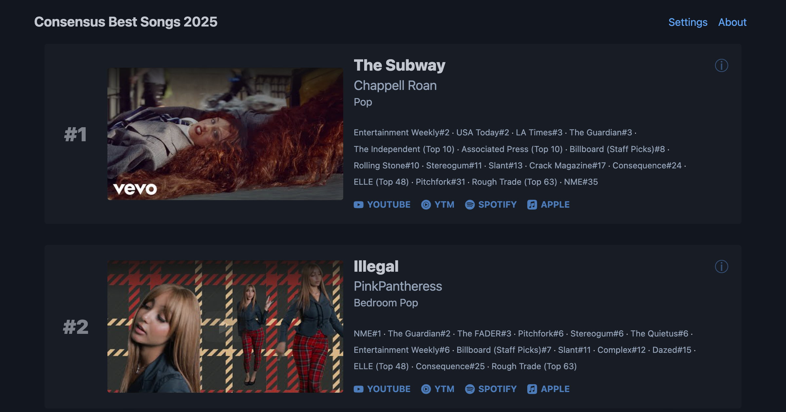
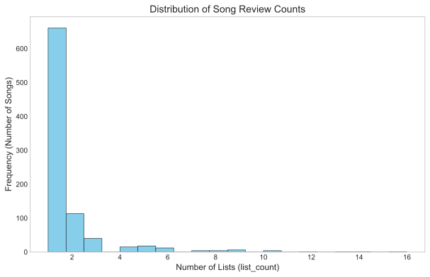
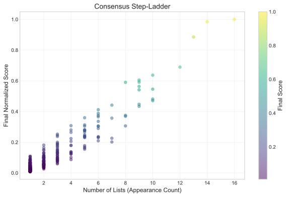
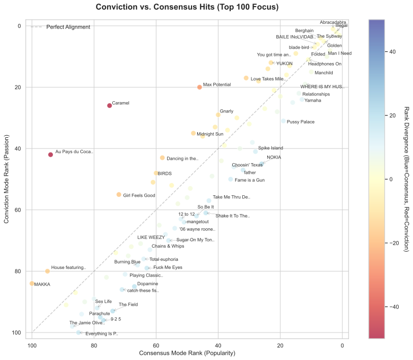
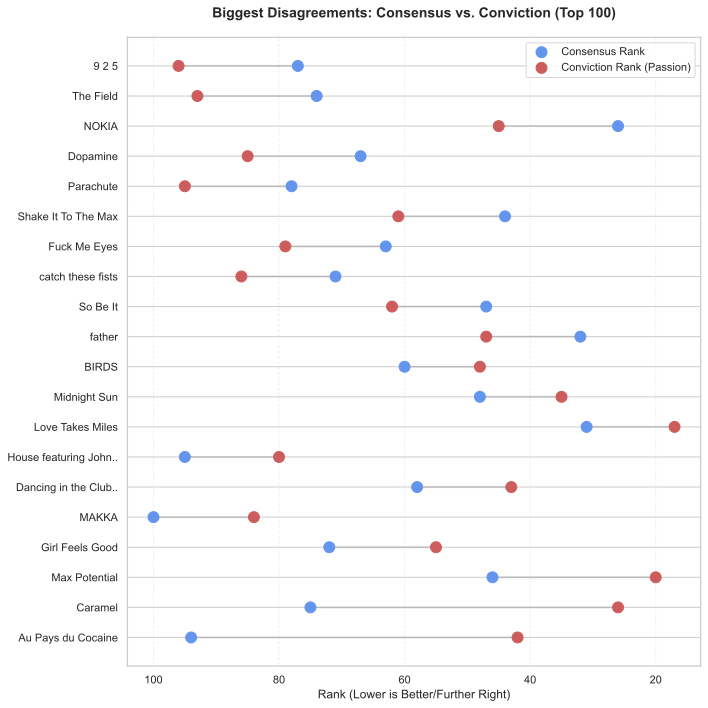
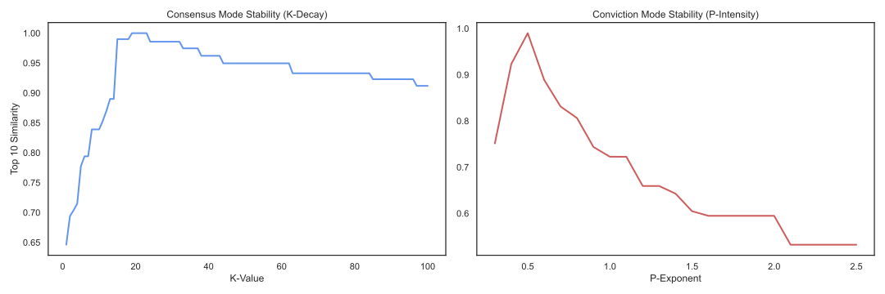
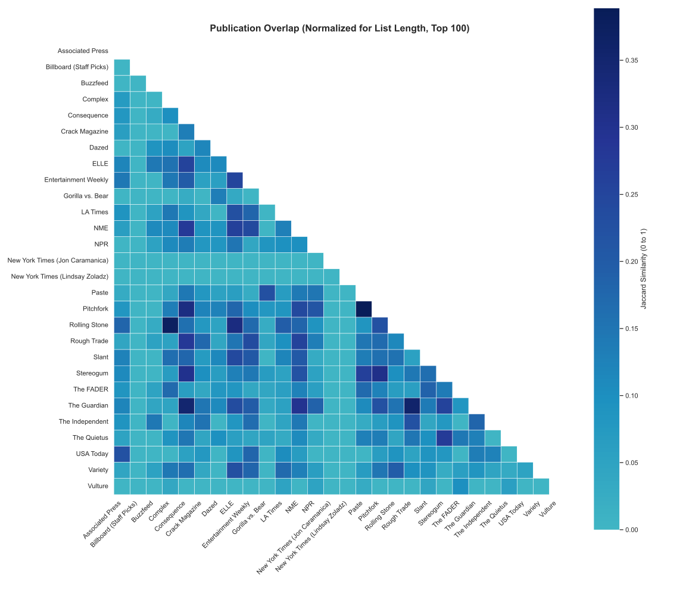
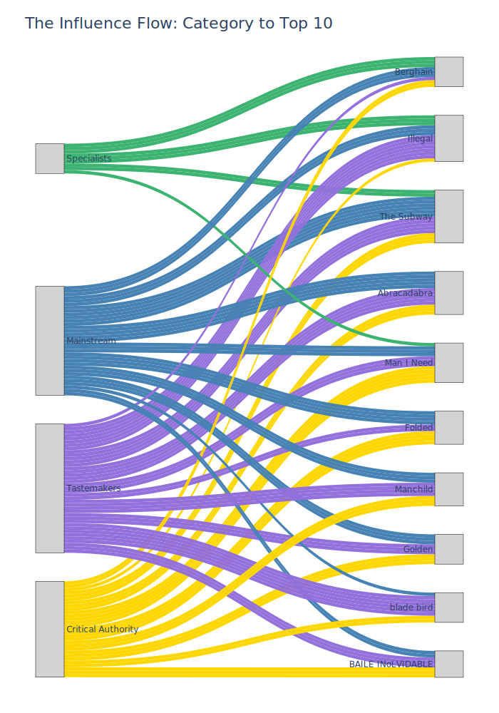

# Consensus Best Songs 2025

🔗 **Live Site:** [https://bestsongs2025.com/](https://bestsongs2025.com/)

<a href="https://bestsongs2025.com/"></a>

## About

This project is the result of a yearly personal obsession: figuring out how to prioritize the latest music based on "Best Songs of 2025" lists from a wide variety of publications. I love finding new music that I wouldn't have discovered otherwise.

It was also a good excuse to experiment with a variety of AI models and tools for Python development, data analysis, and frontend work.

I scraped around 28 song lists and did the following:

- **Canonicalization**: Used the Spotify search API (with [Spotipy](https://spotipy.readthedocs.io/en/latest/)) to find IDs and canonical artist and song names
- **YouTube Matching**: Looked up YouTube Music and YouTube IDs (via ytmusicapi)
- **Quote Extraction**: Ran reviews through Claude Haiku or Sonnet to distill down to a quote per source

I then developed ranking engine with a variety of knobs -- source weights, how much to value a rank #1 song over a #10, how to give boosts to songs that cross publication types or are mentioned on a large number of lists, and more.

The resulting site lets you view the result of that ranking, but you can customize the knobs and share your own, instead. You can also export your personalized ranking as a YouTube playlist or download it as a CSV to import into your favorite streaming service.

## 🏗️ Project Structure

The project is built as a lightweight, static web application with no build steps or complex frameworks.

- **`index.html`**: The main entry point using semantic HTML and Pico CSS
- **`script.js`**: Handles data loading, the ranking engine logic, state management, and DOM rendering
- **`data.json`**: The single source of truth containing:
  - Configuration (ranking parameters, boosters, cluster metadata)
  - Source definitions (weights, URLs, categories)
  - Song data (artists, titles, media IDs, and source citations)

## 🛠️ Technical Choices

- **Static Data**: Chosen for simplicity and ease of hosting. The entire application runs in the browser in plain Javascript with no backend or build steps
- **[Pico CSS](https://picocss.com/)**: A minimal, semantic-first CSS framework that provides a clean "dark mode" aesthetic. I know little of UI or frontend design, so this helped save me from myself
- **URL State Sync**: All ranking parameters (decay rates, boosters, weights) are synchronized to the URL query string, making specific ranking configurations shareable
- **Lite YouTube**: Uses the [lite-youtube](https://github.com/justinribeiro/lite-youtube) web component for fast video embeds
- **Hosting Solution**: Initially I just used Github Pages but decided to move to Vercel with an actual domain name for fun

## Development Quirks

### Data Cleaning

- **Manual Overrides**: I manually corrected or specified around 30 song/artist names to work around Spotify search failures, including songs simply missing from Spotify
- **Matching Heuristics**: Spotify, YouTube, and YouTube Music results were vetted with surprisingly good comparison heuristic functions Gemini 3 Pro helped me with, often using [RapidFuzz](https://pypi.org/project/RapidFuzz/). Many of the review sites also linked to official videos or Spotify tracks, which I leveraged

### Shadow Ranks 👻

Not all lists are ranked. For unranked lists, I assigned a **Shadow Rank** based on the list's length to ensure fair weighting. For example, [Variety's The Best Songs of 2025](https://variety.com/lists/best-songs-2025/) has 61 unranked songs so I used the midpoint
$$(1 + 61) / 2 = 31$$

NPR produced two overlapping lists -- ["The 25 Best Songs of 2025"](https://www.npr.org/2025/12/09/nx-s1-5616663/the-25-best-songs-of-2025) and their full ["The 125 Best Songs of 2025"](https://www.npr.org/nx-s1-5619849). In order to make the shadow ranks more accurate and prevent double counting, I created two non-overlapping sources, one for the top 25 with shadow rank $(1 + 25) / 2 = 13$ and one for the bottom 100 with shadow rank $(26 + 125) / 2 = 75.5$.

### 🏷️ Category Decisions

I wanted to have some notion of crossover hits, letting me boost songs that appeared on multiple types of publications. These are still a work in progress and only used for one boost that can be disabled.

The categories are currently:

- **🏛️ Critical Authority**: Essential critical voices from major institutions known for depth, rigorous standards, and long-standing industry trust.
- **⚡ Tastemakers**: Digital trendsetters and established indie mainstays driving the current musical conversation.
- **🧪 Specialists**: Niche expert curators focused on deep cuts, avant-garde discoveries, and specific genre depth.
- **📡 Mainstream**: High-frequency media outlets and lifestyle sources tracking mass cultural appeal and global broadcasting trends.

### ⚖️ Source Weights

This is really where the subjectivity comes in on top of that of the reviewers! I set the default weights to favor authoritative critical voices while also trying to make sure I didn't completely miss genres and niches. My biases and preferences are certainly in there! The mainstream definitely still comes in heavily, though.

This is where I wanted to give the user full control. They can change the weights and everything is updated in the URL so they can share their own lists.

## AI Development Journey

### Web Chatbots: Gemini 3 Pro

While coding in the notebook, I chatted with [Gemini 3 Pro](https://deepmind.google/models/gemini/pro/) usually in its Thinking mode on the web, getting tips and code for web scraping, parsing, and ranking. All the modern chatbots I've tried are extremely impressive, but there are still problems. Here are the ones I encountered with Gemini 3 Pro:

- **Context changes are hard**: After a long-running chat where we'd discussed and made many decisions, I'd sometimes switch to a new chat to dig into the finer points of one choice, giving it some ramp-up context first. In the new chat, it would essentially tell me how bad the decision I'd made with it in the other chat was, when it had seemed quite satisfied over there!

  If it wasn't a topic I already knew well, it was hard to know if the decision was _actually_ bad -- perhaps because I'd steered it into sycophancy due to my obsession with pros/cons and edge cases -- or the new chat only thought it was bad because I hadn't given it enough context on why the decision was made that way. I suspect this still also happens when tools need to compress the context and lose some detail.

- **Stale information**: Until near the end of the project, I hadn't run into a situation where it really led me astray, but then I asked it about developing a feature to let users export their top N songs to a YouTube playlist. It knew the real heavy weight solution was with OAuth and a supported Google API, but I'd thought one could create an unnamed playlist just by putting some video IDs in a URL for the user. Indeed, you can still sort of do that, but on desktop it appears YouTube has removed the button to save the playlist.
  Gemini was convinced you could click on something to do so or use a variety of other non-working URL format hacks, no matter how much evidence I gave it to the contrary. I wanted it to work, too, Gemini!
- **Code snippets to save on generation**: I do not know Javascript or CSS well. Gemini would sometimes give me a great starting point but if I asked it to refine something, it would start giving me pieces and I'd have to ask it to regenerate the whole file for me. It'd do so, but other bits would often change in the process.
- **Inauthentic names**: Gemini frequently gave proper names to the ranking models we discussed. It made me think they were well-known, standard solutions. Then, later, I'd go search for a name and find it apparently wasn't real or at least not widely known.

### Cursor

This was my first experience with Cursor. A few thoughts:

- **Enthusiasm**: Much like Claude Code, the Cursor agent chat interface _wants to do stuff_. It doesn't feel like a great place to _discuss_ a solution, which is why I continued to use Gemini on the web. Asking about something in the agent chat tended to result in it going off and building something. I did love that when I asked it to do something, though, it was incredibly enthusiastic. "I'll commit these changes for you!"
- **Weird review/commit bugs**: I was probably using it wrong, but often even if I clicked Review and accepted changes and even if they were committed, it seemed to think they were still open files.
- **Sonnet 4.5 integration**: Cursor seemed well-optimized for this model. I didn't notice from the scroll of its "thoughts" that it had to back track much. When I tried Gemini 3 Pro Preview, it occasionally got stuck in a loop or its "thoughts" suggested it had to back track or go another way.
- **CSS best practices**: The models didn't initially prioritize mobile-first design and sometimes snuck in fixed pixel widths or used CSS that wasn't well aligned with Pico CSS's conventions despite prompting.

### Quote extraction task

One of the tasks in the notebook was to extract a decent quote from the normally paragraph-long review of a song from each source site. LLMs love to summarize or smooth over the grammar broken by the extraction, so this was a challenge.

I wanted to be very careful, here, so enforced strict substring matching, either of the full quote or pieces joined by " ... ". I also added a way for the model to report failure since some reviews just weren't appropriate (for example, talking about the artist but not the song).

Ultimately I made a first pass with Haiku and then fell back to Sonnet for cases that didn't work.

### Claude Code

More recently, I've gone back to Claude Code and doing the planning mode -> execute plan -> review routine. Doing this with Opus feels very solid but costly.

## Analysis

### Overall

Counting NPR as one source with a review count of 125:

* Unique songs: `881`
* Total song reviews: `1438`
* Average reviews per source: `51.36`
* Median reviews per source: `49.0`
* Total sources: `28`
* Total ranked sources: `22`
* Total unranked sources: `6`

#### Reviews per song

| Top N     | Average reviews per song | Median reviews per song |
| :-------- | :----------------------- | :---------------------- |
| Top 5     | 13.00                    | 13.00                   |
| Top 10    | 11.00                    | 10.00                   |
| Top 25    | 8.88                     | 9.00                    |
| Top 50    | 6.92                     | 6.00                    |
| Top 100   | 5.16                     | 5.00                    |
| Top 200   | 3.48                     | 3.00                    |
| Top 500   | 2.11                     | 1.00                    |
| All (881) | 1.63                     | 1.00                    |



#### Unique Artists

- Unique artist (including collaborators) strings: `683`
- Unique primary artist IDs (1st listed Spotify artist): `628`

#### Primary artists with at least 5 cited songs

| primary_artist_name | song_count | songs                                                                                                                                                                                                                               |
| :------------------ | :--------- | :---------------------------------------------------------------------------------------------------------------------------------------------------------------------------------------------------------------------------------- |
| Lorde               | 7          | Current Affairs · David · Favourite Daughter · Hammer · Man Of The Year · Shapeshifter · What Was That                                                                                                                              |
| Miley Cyrus         | 6          | Dream As One - from Avatar: Fire and Ash · Easy Lover · End of the World · Every Girl You've Ever Loved (feat. Naomi Campbell) · Pretend You're God · Walk of Fame (feat. Brittany Howard)                                          |
| Geese               | 6          | Au Pays du Cocaine · Getting Killed · Husbands · Long Island City Here I Come · Taxes · Trinidad                                                                                                                                    |
| ROSALÍA             | 6          | Berghain · Divinize · La Perla · La Rumba Del Perdón · Porcelana · Reliquia                                                                                                                                                         |
| FKA twigs           | 6          | Drums of Death · Girl Feels Good · HARD · Room of Fools · Stereo Boy · Striptease                                                                                                                                                   |
| Cardi B             | 6          | Bodega Baddie · ErrTime · Imaginary Playerz · Magnet · Outside · Pretty & Petty                                                                                                                                                     |
| Oklou               | 5          | blade bird · obvious · take me by the hand · thank you for recording · viscus (feat. FKA twigs)                                                                                                                                     |
| Addison Rae         | 5          | Fame is a Gun · Headphones On · High Fashion · Money is Everything · Times Like These                                                                                                                                               |
| Clipse              | 5          | Chains & Whips · F.I.C.O. · P.O.V. · So Be It · The Birds Don't Sing                                                                                                                                                                |
| Playboi Carti       | 5          | ALIVE · EVIL J0RDAN · LIKE WEEZY · OLYMPIAN · OPM BABI                                                                                                                                                                              |
| Turnstile           | 5          | BIRDS · LIGHT DESIGN · LOOK OUT FOR ME · NEVER ENOUGH · SOLE                                                                                                                                                                        |
| Blood Orange        | 5          | Mind Loaded (feat. Caroline Polachek, Lorde & Mustafa) · Somewhere in Between · The Field (feat. The Durutti Column, Tariq Al-Sabir, Caroline Polachek & Daniel Caesar) · Vivid Light · Westerberg (feat. Eva Tolkin & Liam Benzvi) |
| Justin Bieber       | 5          | DAISIES · DEVOTION · FIRST PLACE · GO BABY · YUKON                                                                                                                                                                                  |
| Wednesday           | 5          | Elderberry Wine · Pick Up That Knife · The Way Love Goes · Townies · Wound Up Here (By Holdin On)                                                                                                                                   |
| billy woods         | 5          | A Doll Fulla Pins · BLK XMAS · Corinthians · Misery · Waterproof Mascara                                                                                                                                                            |

#### Media Links

- Total songs: `881`
- Songs with Spotify URL: `869` (`98.64%`)
- Songs with YouTube URL: `407` (`46.20%`)
- Songs with YouTube Music URL: `873` (`99.09%`)
- Songs with Apple Music URL: `873` (`99.09%`)

#### Most Frequently Listed Songs

| artist                       | name                 | list_count |
| :--------------------------- | :------------------- | :--------- |
| Chappell Roan                | The Subway           | 16         |
| PinkPantheress               | Illegal              | 14         |
| Lady Gaga                    | Abracadabra          | 13         |
| Olivia Dean                  | Man I Need           | 12         |
| Sabrina Carpenter            | Manchild             | 10         |
| RAYE                         | WHERE IS MY HUSBAND! | 10         |
| Kehlani                      | Folded               | 10         |
| Dijon                        | Yamaha               | 10         |
| Tate McRae                   | Sports car           | 9          |
| ROSALÍA, Björk, & Yves Tumor | Berghain             | 9          |

#### Ranked Sources

| name                                                                                                                         | songs | default weight | category              |
| :--------------------------------------------------------------------------------------------------------------------------- | :---- | :------------- | :-------------------- |
| [Billboard (Staff Picks)](https://www.billboard.com/lists/best-songs-2025)                                                   | 100   | 0.70           | 📡 Mainstream         |
| [Buzzfeed](https://www.buzzfeed.com/andrewfirriolo/favorite-songs-of-2025)                                                   | 25    | 0.50           | 📡 Mainstream         |
| [Complex](https://www.complex.com/music/a/dimassanfiorenzo/best-songs-2025)                                                  | 50    | 0.90           | ⚡ Tastemakers        |
| [Consequence](https://consequence.net/list/200-best-songs-of-2025-annual-report/)                                            | 200   | 0.80           | ⚡ Tastemakers        |
| [Crack Magazine](http://crackmagazine.net/article/list-article/best-tracks-2025/)                                            | 25    | 0.70           | 🧪 Specialists        |
| [Dazed](https://www.dazeddigital.com/music/article/69273/1/20-best-tracks-of-2025-ranked-ethel-cain-smerz-esdeekid-fakemink) | 20    | 0.60           | 🧪 Specialists        |
| [Entertainment Weekly](https://ew.com/the-10-best-songs-of-2025-11864116)                                                    | 10    | 0.50           | 📡 Mainstream         |
| [Gorilla vs. Bear](https://www.gorillavsbear.net/gorilla-vs-bears-songs-of-2025/)                                            | 33    | 0.90           | ⚡ Tastemakers        |
| [LA Times](https://www.latimes.com/entertainment-arts/music/story/2025-12-04/25-best-songs-of-2025)                          | 25    | 1.00           | 🏛️ Critical Authority |
| [NME](https://www.nme.com/lists/end-of-year/best-songs-2025-3912937)                                                         | 50    | 0.80           | ⚡ Tastemakers        |
| [New York Times (Jon Caramanica)](https://www.nytimes.com/2025/12/07/arts/music/best-songs-2025.html)                        | 20    | 1.00           | 🏛️ Critical Authority |
| [New York Times (Lindsay Zoladz)](https://www.nytimes.com/2025/12/07/arts/music/best-songs-2025.html)                        | 20    | 1.00           | 🏛️ Critical Authority |
| [Paste](https://www.pastemagazine.com/music/best-songs/the-100-best-songs-of-2025)                                           | 100   | 0.70           | ⚡ Tastemakers        |
| [Pitchfork](https://pitchfork.com/features/lists-and-guides/best-songs-2025/)                                                | 100   | 1.00           | ⚡ Tastemakers        |
| [Rolling Stone](https://www.rollingstone.com/music/music-lists/best-songs-of-2025-1235468614)                                | 100   | 1.00           | 🏛️ Critical Authority |
| [Slant](http://slantmagazine.com/music/the-50-best-songs-of-2025/)                                                           | 50    | 0.90           | ⚡ Tastemakers        |
| [Stereogum](https://stereogum.com/2480811/the-50-best-songs-of-2025/lists/year-in-review/2025-in-review)                     | 50    | 0.70           | ⚡ Tastemakers        |
| [The FADER](https://www.thefader.com/2025/12/09/best-songs-2025)                                                             | 51    | 0.90           | ⚡ Tastemakers        |
| [The Guardian](https://www.theguardian.com/music/ng-interactive/2025/dec/03/the-20-best-songs-of-2025)                       | 22    | 0.90           | 🏛️ Critical Authority |
| [The Quietus](https://thequietus.com/tq-charts/tracks-of-the-year/the-quietus-tracks-of-the-year-2025/)                      | 50    | 0.70           | 🧪 Specialists        |
| [USA Today](https://www.usatoday.com/story/entertainment/music/2025/12/17/best-songs-2025-ranking/87703729007/)              | 10    | 0.50           | 📡 Mainstream         |
| [Vulture](https://www.vulture.com/article/best-songs-2025.html)                                                              | 10    | 1.00           | 🏛️ Critical Authority |

#### Unranked Sources

| name                                                                                                                      | songs | default weight | shadow rank | category              |
| :------------------------------------------------------------------------------------------------------------------------ | :---- | :------------- | :---------- | :-------------------- |
| [Associated Press](https://apnews.com/article/best-songs-2025-6a4712aa815b7554790ff28fbdff220b)                           | 10    | 0.60           | 5.50        | 📡 Mainstream         |
| [ELLE](https://www.elle.com/culture/music/a65322446/best-songs-of-2025/)                                                  | 48    | 0.50           | 24.50       | 📡 Mainstream         |
| [NPR Top 125](https://www.npr.org/nx-s1-5619849)                                                                          | 100   | 1.00           | 75.50       | 🏛️ Critical Authority |
| [NPR Top 25](https://www.npr.org/nx-s1-5616663)                                                                           | 25    | 1.00           | 13.00       | 🏛️ Critical Authority |
| [Rough Trade](https://blog.roughtrade.com/gb/the-best-songs-of-2025/)                                                     | 63    | 0.60           | 32.00       | 🧪 Specialists        |
| [The Independent](https://www.the-independent.com/arts-entertainment/music/features/the-best-songs-of-2025-b2884545.html) | 10    | 0.60           | 5.50        | 📡 Mainstream         |
| [Variety](https://variety.com/lists/best-songs-2025)                                                                      | 61    | 0.50           | 31.00       | 📡 Mainstream         |

NPR provided two overlapping lists -- their top 25 and their top 125. I split this into two non-overlapping unranked lists, one for the top 25 and the other for the bottom 100.

### Ranking

Using the default ranking (which uses consensus mode):

#### List Count vs Score



- Score spread even at lower list counts
- A few songs with very high scores driven by number of list counts at the top of the range

#### Consensus Mode vs Conviction Mode

The site defaults to Consensus mode, but you can choose to use a power law decay formula, instead, to try to give more favor to critical passion over appearing on more lists. Here's a plot showing a possible Conviction mode setup with extra boosts for #1s with cluster and consensus boosts down to 0%:



##### How to read this chart

- **The Diagonal (Perfect Alignment)**: Undisputed hits regardless of model, performing similarly either way
- **The red zone (Conviction picks)**: These tracks may have appeared on fewer total lists, but the publications that included them ranked them extremely high (often #1 or #2)
- **The blue zone (Consensus picks)**: These tracks may have appeared on a majority of lists but potentially at lower ranks

##### Notes

- For the best songs of the year, the top 10 are mostly unchanged
- The red dots might be more interesting for discovering new sounds!



##### Ranking Mode Stability



- **Consensus Stability**: The model reaches peak stability around K=25, where the Top 10 remains 100% consistent across a wide range of decay settings. (The current default is K=20 for this mode right now)
- **Conviction Intensity**: The default P=0.55 is the peak of the stability curve. It provides enough "intensity" to highlight passion picks without making the model so volatile that individual outliers dominate

### Publications



### Categories



## 🤖 Claude Code Setup

If you're using [Claude Code](https://claude.ai/claude-code) for development, you can enable the Playwright MCP server to allow Claude to view, screenshot, and interact with the website during development.

### Setup

1. Add the Playwright MCP server:
   ```bash
   claude mcp add playwright npx '@playwright/mcp@latest'
   ```

2. Restart Claude Code to load the new configuration.

3. Start a local HTTP server in a separate terminal:
   ```bash
   python -m http.server 8000
   ```

This enables tools like `browser_navigate`, `browser_take_screenshot`, `browser_click`, and `browser_snapshot` for visual verification during development.

## 🧪 Testing

This project uses [Playwright](https://playwright.dev/python/) with `pytest` for end-to-end testing of the application. The test suite covers:

- **Core Rendering**: Verifies the song list, titles, and dynamic media links (YouTube, Spotify, etc.)
- **Interactive Logic**: Ensures user interactions like adjusting sliders update the URL state correctly
- **Modals**: Checks that detailed views (Reviews, Stats, About, Settings) render properly

### Running the Tests

1. Navigate to the python directory: `cd python`
2. Install dependencies: `uv sync` (if not already installed)
3. Run the full suite: `uv run pytest`

## 👤 Contact

You can find me over at [LinkedIn](https://www.linkedin.com/in/everett-anderson-swe/).
